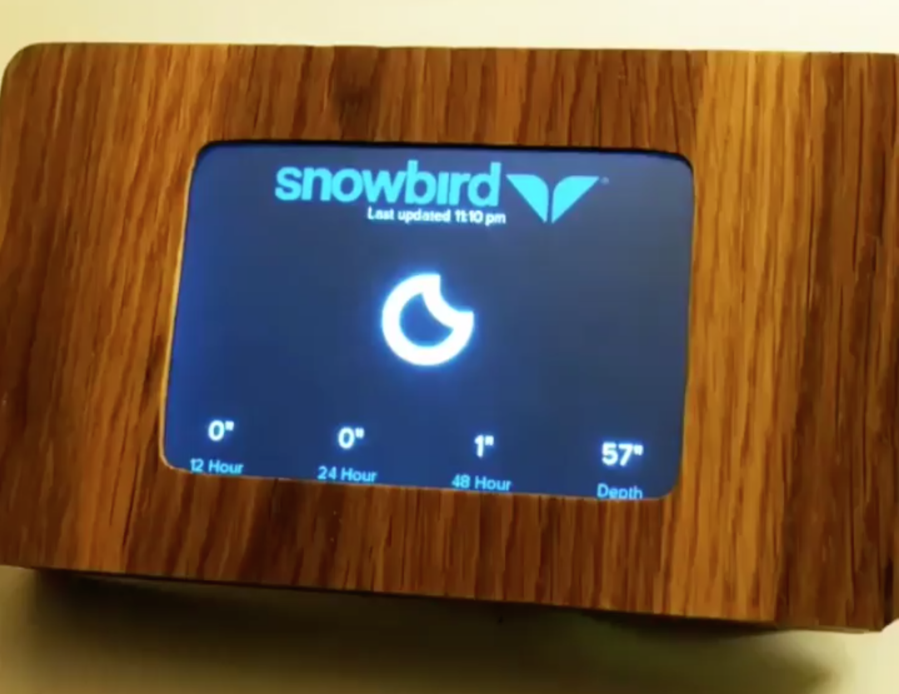

# Snowbird
## An internet-enabled desktop widget, using Python on a Raspberry Pi Zero

The Snowbird desktop widget parses current weather data from the [Snowbird Ski Resort](http://snowbird.com) website and displays it on a 3.5" touchscreen, mounted inside a custom-made wood enclosure.

Click the image below to see the Snowbird widget in action.

[](http://i.imgur.com/HrovSWZ.gifv)

### Python
`main.py` contains all of the app logic and widget declarations.
`snowbird.kv` contains all the Kivy layout declarations.

### Accessing the pi
If the pi is connected to your local network, you can access it with `ssh pi@snowbird.local` The password is `snowbird`

If the pi is not connected to your network, or you want to access it via Ethernet-Over-USB, pop out the SD card and use the adapter to insert it into your SD card reader. 

### Network settings
To change the wifi network settings, edit `ssid` and `psk` by doing `sudo vim /etc/wpa_supplicant/wpa_supplicant.conf`

`/etc/network/interfaces` should have the following block in order for wifi to come up automatically:

```bash
auto wlan0
allow-hotplug wlan0
iface wlan0 inet dhcp
  	wpa-conf /etc/wpa_supplicant/wpa_supplicant.conf
```

If you want to access your pi over USB (if wifi isn't working), backup `/boot/cmdline.txt` and rename `/boot/cmdline-ethernet-gadget.txt` to `/boot/cmdline.txt` Pop the SD card back into the pi, plug a USB micro cable into the USB OTG port on the pi (where the wifi is plugged in) and plug it into your computer. It should appear as a network interface, and you should be able to `ssh pi@snowbird.local` after a minute or so.

### Other important files
There are two scripts involved with starting the widget. 

The first is `/etc/init.d/start-fbcp` which takes care of starting `fbcp`, a program that copies the primary framebuffer to the secondary framebuffer (necessary for displaying the primary console (i.e. what you would see if you plugged in an HDMI monitor) to the secondary framebuffer that runs the TFT screen).

The second script is `/etc/init.d/start-snowbird` which starts the python kivy app.

You can stop or start these directly by using, for example, `sudo /etc/init.d/start-snowbird [stop|start]` You can also change the scripts or add your own boot scripts by following the [directions on this page.](http://www.stuffaboutcode.com/2012/06/raspberry-pi-run-program-at-start-up.html). Make sure not to skip the `chmod` or `update-rc.d` commands or things won't start on boot like you want.

### Logging and Config
The Kivy process (`main.py`) is logging to `/var/log/snowbird`. A new sequentially-named logfile is created every time the process is started. Logging location, level, and other kivy parameters can be changed in the kivy `config.ini`. Note: If you're running the process by hand using the `pi` user, the kivy config folder is at `/home/pi/.kivy`. However, the init process that starts `main.py` on boot is running as the `root` user, so you'll probably want to play around with `/root/.kivy` (as the `root` user) instead. 